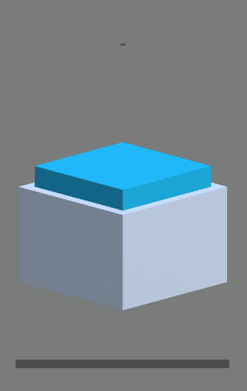

# UnityAudioSourceEvents
This package adds helper classes to get notified when a Unity `AudioSource` starts playing, is paused or played until the end. Both C# events and a base class with callbacks are supported.

The following states are observed:

* Started
* Paused
* Resumed
* Stopped

## Installation

The package can be installed via the Unity Package Manager.
Simply follow [this guide](https://docs.unity3d.com/Manual/upm-ui-giturl.html) and use the following url: `git+https://github.com/Moolt/UnityAudioSourceEvents?path=Packages/AudioSourceEvents`

All scripts are contained within the `AudioSourceEvents` namespace.

## Usage

The simplest way is to inherit from the `AudioSourceObserver` base class.
It privides the `OnAudioStart`, `OnAudioResume`, `OnAudioPaused`, `OnAudioStopped` and `OnAudioChanged` callbacks which can be overridden with your custom logic.

`OnAudioChanged` combines all other callbacks by directly providing the current state.

In this example the state of the `AudioSource` is observed and displayed in the UI as text.
The `InheritanceExample` script needs to be on the same object as the `AudioSource` you want to observe.

```csharp
public class InheritanceExample : AudioSourceObserver
{
    [SerializeField] private Text text;

    protected override void OnAudioChanged(AudioState state)
    {
        base.OnAudioChanged(state);

        text.text = state.ToString();
    }
}
```

Alternatively C# events can be used to observe an `AudioSource`. Therefore a reference to the `AudioSource` is required to call the `RequestEventHandlers` method on. It will return an instance of `IAudioEventSource` containing C# events you can subscribe to.

Don't forget to unsubscribe from the events in the `OnDestroy` method.

```csharp
[RequireComponent(typeof(AudioSource))]
public class EventExample : MonoBehaviour
{
    [SerializeField] private Text text;

    private AudioSource _audioSource;
    private IAudioEventSource _eventSource;

    private void Start()
    {
        _audioSource = GetComponent<AudioSource>();
        _eventSource = _audioSource.RequestEventHandlers();

        _eventSource.Changed += OnAudioSourceChanged;
    }

    private void OnDestroy()
    {
        _eventSource.Changed -= OnAudioSourceChanged;
    }

    private void OnAudioSourceChanged(object sender, AudioState state)
    {
        text.text = state.ToString();
    }
}
```

## How does it work?

It's implemented using polling the `isPlaying` state of an `AudioSource`. While this may not be the most efficient method, it works and its performance impact is certainly insignificant.

## Sample

This repository contains sample scenes where you can see the code provided above in action. ( [Download zip](https://github.com/Moolt/UnityAudioSourceEvents.git) )

